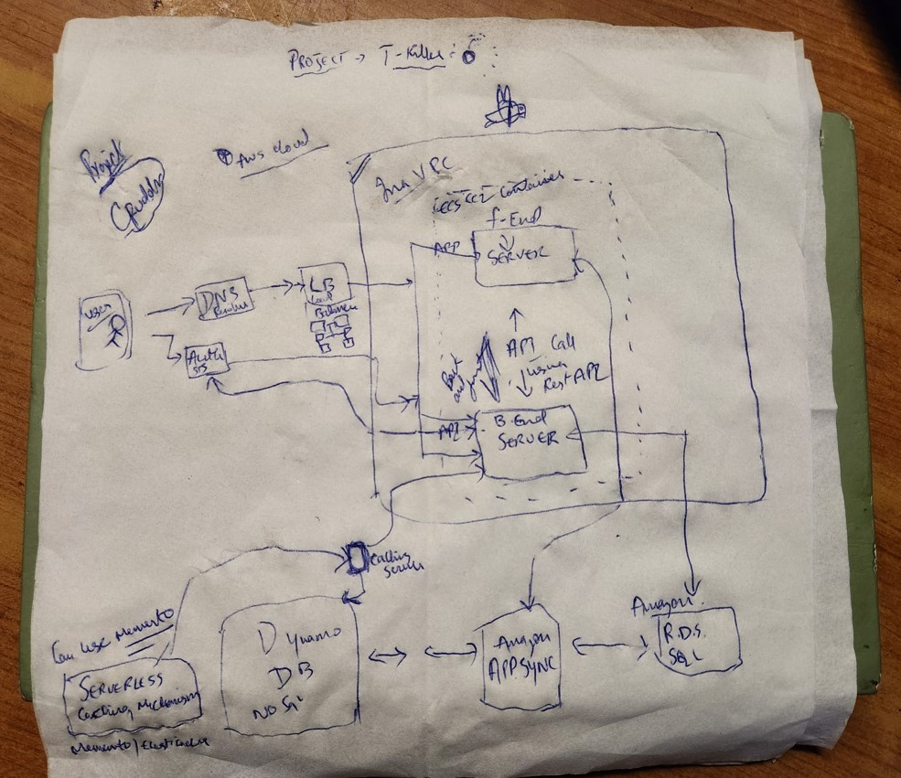
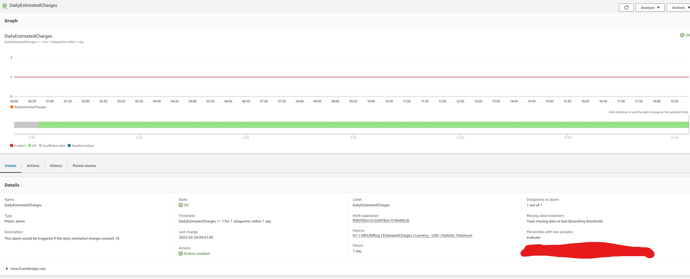
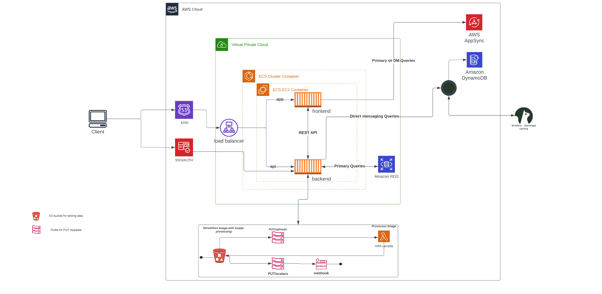

# Week 0 — Billing and Architecture

## Required Homework/Tasks

### Install and verified AWS CLI 

I have installed the AWS CLI via CLI in gitpod terminal and pushed the changes to the gitpod.yml file. 

### Recreate Conceptual Diagram in Lucid Charts or on a Napkin. 

### Created a billing Alarm using the CLI - US-EAST-1. 
I created a billing alarm using the AWS UI also practised my hands on creating the creating the cloud watch alarm via CLI 

### Generated AWS Credentials 
Created a user for myself and added to a group called as - admins and assigned the group admin privileges, downloaded the .csv for the secret access keys generated

### Created a budget for my user account via CLI and AWS budgets UI. 
I created a budget using the CLI and AWS budgets UI, Initially it was tough with the syntax and everything - learnt to troubleshoot the CLI and made sure the syntax was correct. It took me two hours + to fix this, Finally phew I got over it. 
 

### Recreating the Logical app design using the Lucid charts. 

[Lucid charts shared link](https://lucid.app/lucidchart/810a8400-88fb-4a37-b970-eccad375a8c5/edit?viewport_loc=-1012%2C57%2C3864%2C1397%2C0_0&invitationId=inv_0f3f6ad8-c000-4fd9-be21-a698aaf4a516)

